---
## Author
author:
  name: Зубов Иван Александрович
  degrees: DSc
  orcid: 0000-0002-0877-7063
  email: 1132243112@rudn.ru
  affiliation:
    - name: Российский университет дружбы народов
      country: Российская Федерация
      postal-code: 117198
      city: Москва
      address: ул. Миклухо-Маклая, д. 6
## Title
title: Лабораторная работа №4
subtitle: Презентация
license: CC BY
date: today
date-format: "YYYY-MM-DD" # Example: 2025-09-06
---

# Информация

## Докладчик

  * Зубов Иван Александрович
  * Студент
  * Российский университет дружбы народов
  * 1132243112@pfur.ru

# Выполнение лабораторной работы

## Запускаем наш сервер

:::::::::::::: {.columns align=center}
::: {.column width="70%"}

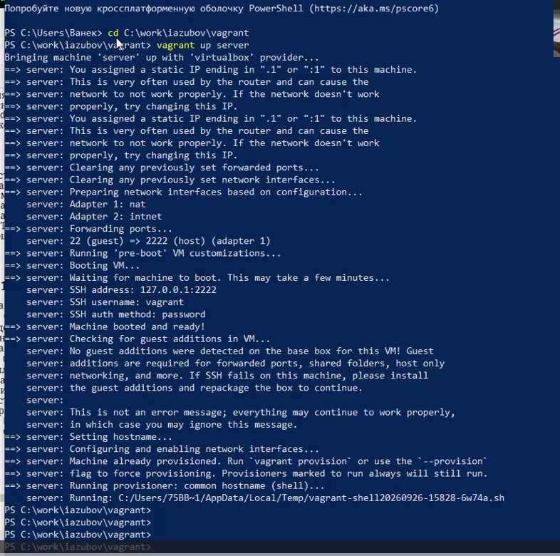

:::
::::::::::::::

## Установка веб сервера

:::::::::::::: {.columns align=center}
::: {.column width="70%"}

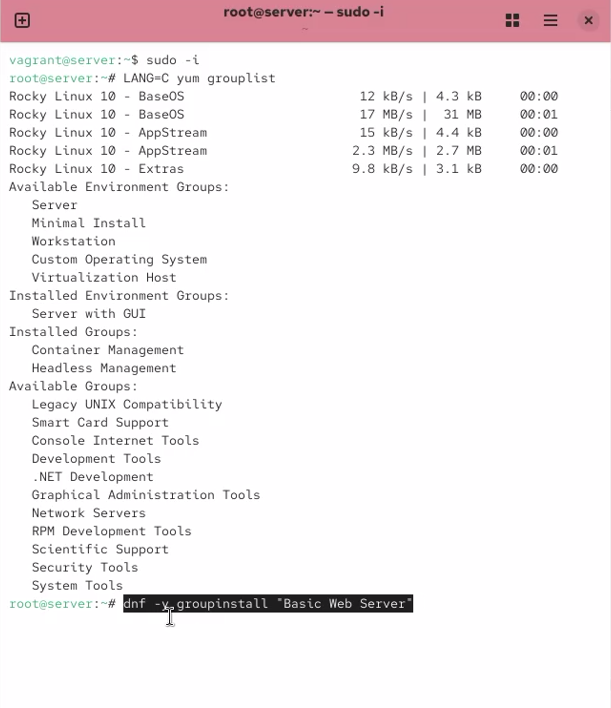

:::
::::::::::::::

## Основной файл httpd.conf

:::::::::::::: {.columns align=center}
::: {.column width="80%"}

:::
::::::::::::::

## manual.conf

:::::::::::::: {.columns align=center}
::: {.column width="80%"}

:::
::::::::::::::

## ssl.conf

:::::::::::::: {.columns align=center}
::: {.column width="80%"}

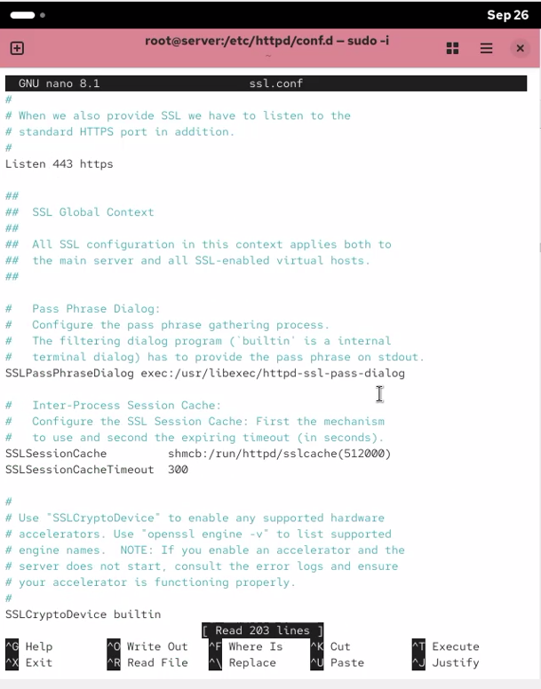

:::
::::::::::::::

## userdir.conf

:::::::::::::: {.columns align=center}
::: {.column width="80%"}

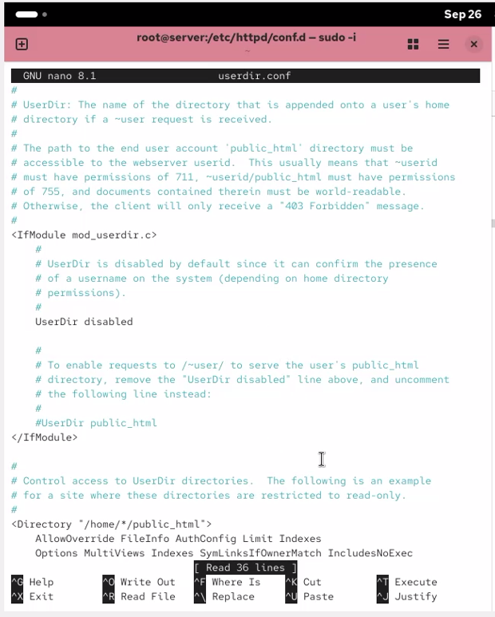

:::
::::::::::::::

## Настройка межсетевого экрана

:::::::::::::: {.columns align=center}
::: {.column width="80%"}

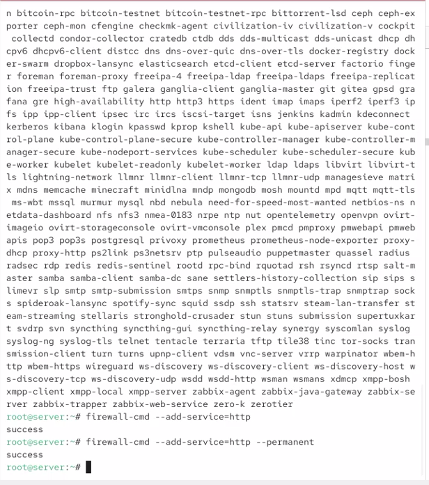

:::
::::::::::::::

## Изменение обратной DNS-зоны

:::::::::::::: {.columns align=center}
::: {.column width="80%"}

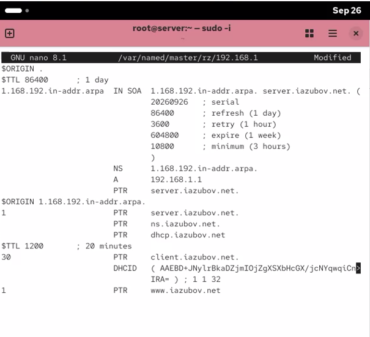

:::
::::::::::::::

## Удаление журналов DNS и запуск named

:::::::::::::: {.columns align=center}
::: {.column width="80%"}

:::
::::::::::::::

## Создан конфигурационный файл виртуального хоста server.iazubov.net

:::::::::::::: {.columns align=center}
::: {.column width="80%"}

:::
::::::::::::::

## Создан второй виртуальный хост www.iazubov.net

:::::::::::::: {.columns align=center}
::: {.column width="80%"}

:::
::::::::::::::

## Создание каталога сайта и index.html

:::::::::::::: {.columns align=center}
::: {.column width="80%"}

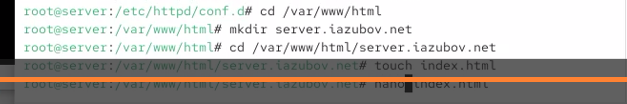

:::
::::::::::::::

## Права, SELinux и перезапуск Apache

:::::::::::::: {.columns align=center}
::: {.column width="80%"}

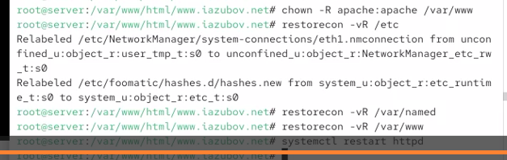

:::
::::::::::::::

## Проверка виртуального веб-сервера

:::::::::::::: {.columns align=center}
::: {.column width="80%"}

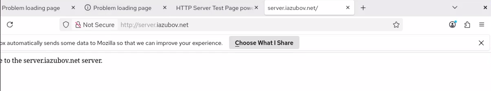

:::
::::::::::::::

## Сохранение настроек для Vagrant 

:::::::::::::: {.columns align=center}
::: {.column width="80%"}

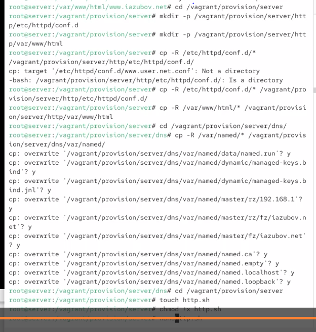

:::
::::::::::::::

## Создание http.sh

:::::::::::::: {.columns align=center}
::: {.column width="80%"}

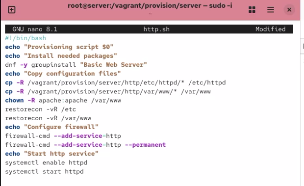

:::
::::::::::::::

## Изменение Vagrantfile

:::::::::::::: {.columns align=center}
::: {.column width="80%"}

:::
::::::::::::::
