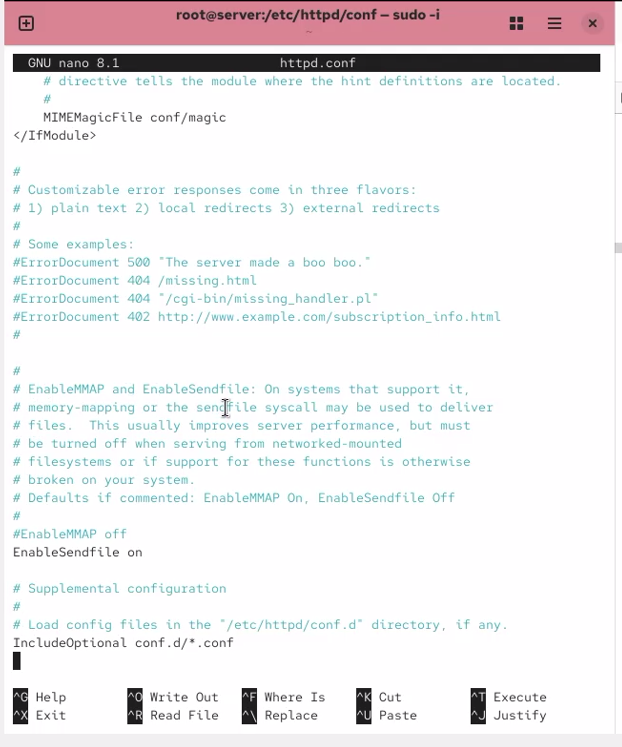
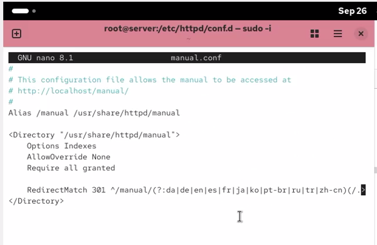
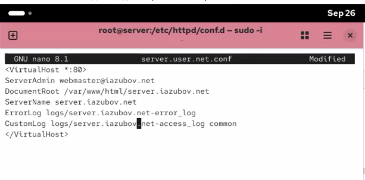
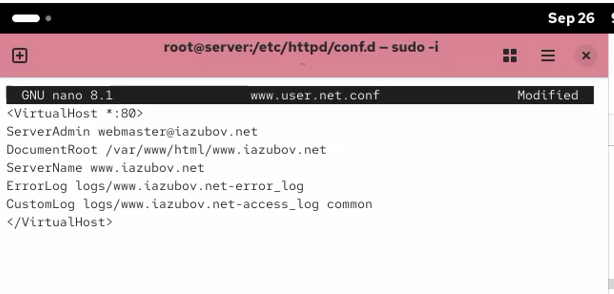
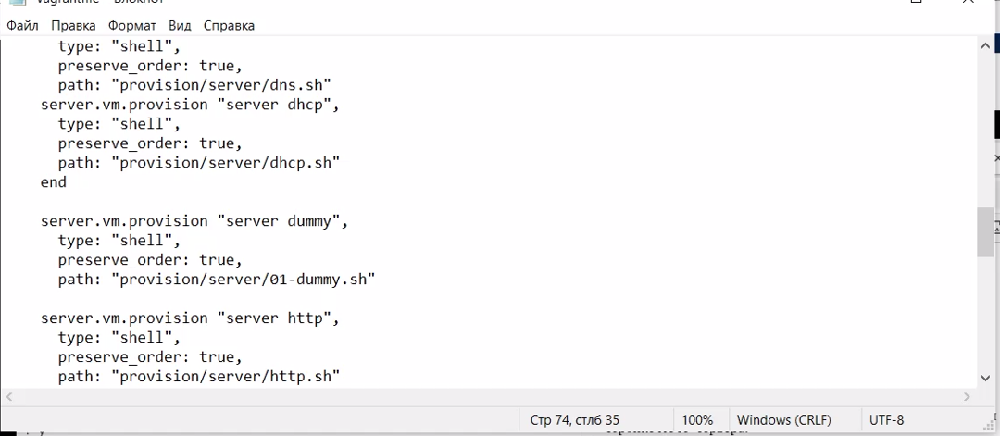

---
## Author
author:
  name: Зубов Иван Александрович
  degrees: DSc
  orcid: 0000-0002-0877-7063
  email: 11232243112@rudn.ru
  affiliation:
    - name: Российский университет дружбы народов
      country: Российская Федерация
      city: Москва
      address: ул. Миклухо-Маклая, д. 6

## Title
title: "Лабораторная работа №4"
subtitle: "Отчет"
license: "CC BY"
abstract: |

---

# Введение

## Цель работы

Приобретение практических навыков по установке и базовому конфигурированию HTTP-сервера Apache.

## Задачи

1. Установите необходимые для работы HTTP-сервера пакеты (см. раздел 4.4.1).
2. Запустите HTTP-сервер с базовой конфигурацией и проанализируйте его работу
(см. разделы 4.4.2 и 4.4.3).
3. Настройте виртуальный хостинг (см. раздел 4.4.4).
4. Напишите скрипт для Vagrant, фиксирующий действия по установке и настройке
HTTP-сервера во внутреннем окружении виртуальной машины server. Соответствующим образом внесите изменения в Vagrantfile (см. раздел 4.4.5).

# Выполнение лабораторной работы

Запускаем наш сервер

{#fig-001 width=70%}

Установите из репозитория стандартный веб-сервер (HTTP-сервер и утилиты httpd,криптоутилиты и пр.)

{#fig-002 width=70%}

Просмотрен основной конфигурационный файл Apache /etc/httpd/conf/httpd.conf. В нём находятся основные параметры работы HTTP-сервера и подключаются дополнительные конфигурационные файлы из каталога /etc/httpd/conf.d.

{#fig-003 width=70%}

Просмотрен дополнительный конфигурационный файл manual.conf. Он содержит настройки доступа к установленной документации Apache через веб-сервер.

{#fig-004 width=70%}

Просмотрен файл ssl.conf, содержащий параметры работы Apache по защищённому протоколу HTTPS. В конфигурации используется стандартный HTTPS-порт 443

{#fig-005 width=70%}

Просмотрен файл userdir.conf, отвечающий за возможность публикации веб-страниц из домашних каталогов пользователей. В стандартной конфигурации функция UserDir отключена.

{#fig-006 width=70%}

В межсетевом экране firewalld разрешена работа HTTP-сервиса. Правило добавлено как для текущего сеанса, так и постоянно, чтобы сохраняться после перезагрузки системы.
После установки и базовой настройки Apache был запущен просмотр системного журнала в режиме реального времени с помощью команды:journalctl -x -f
Это позволило контролировать сообщения системы во время запуска HTTP-сервера. Затем служба Apache была добавлена в автозапуск и запущена командами:systemctl enable httpd, systemctl start httpd
Далее была запущена виртуальная машина client. На сервере в отдельных терминалах выполнялся просмотр журнала ошибок Apache

{#fig-007 width=70%}

В файл обратной DNS-зоны /var/named/master/rz/192.168.1 добавлена PTR-запись для нового веб-узла www.iazubov.net. Это позволяет определить доменное имя веб-сервера по его IP-адресу. Также делаем с www A 192.168.1.1

{#fig-008 width=70%}

После изменения DNS-зон удалены журнальные файлы .jnl, чтобы исключить использование старых динамических данных зон. Затем DNS-сервер named был снова запущен.

{#fig-009 width=70%}

Создан конфигурационный файл виртуального хоста server.iazubov.net. Для него указаны имя сервера, каталог веб-контента и отдельные файлы журналов ошибок и обращений.

{#fig-010 width=70%}

Создан второй виртуальный хост www.iazubov.net. Для него настроен отдельный каталог с веб-контентом, а также собственные журналы ошибок и доступа.

{#fig-011 width=70%}

В каталоге /var/www/html создан отдельный каталог виртуального веб-сервера и файл главной страницы index.html. В данный файл далее помещается тестовое приветственное сообщение для проверки работы виртуального хоста.

{#fig-012 width=70%}

Для содержимого веб-сервера установлен владелец apache:apache, после чего восстановлены контексты безопасности SELinux для конфигурационных и веб-каталогов. Затем HTTP-сервер Apache был перезапущен для применения новых настроек.

{#fig-013 width=70%}

На виртуальной машине client выполнена проверка доступа к веб-серверу по доменному имени server.iazubov.net. В браузере успешно открылась тестовая страница, что подтверждает правильную работу DNS и виртуального хостинга Apache.

{#fig-014 width=70%}

Создана структура каталогов /vagrant/provision/server/http, после чего в неё скопированы конфигурационные файлы Apache и содержимое веб-серверов. Также обновлены сохранённые файлы конфигурации DNS-сервера.

{#fig-015 width=70%}

Создан provisioning-скрипт http.sh, автоматизирующий установку и настройку HTTP-сервера. Скрипт устанавливает Apache, копирует сохранённые конфигурационные файлы, корректирует права и SELinux-контексты, настраивает межсетевой экран и запускает службу httpd.

{#fig-016 width=70%}

В файл Vagrantfile добавлен новый provisioning-блок server http, указывающий на скрипт provision/server/http.sh

{#fig-017 width=70%}

# Контрольный вопросы

1. Через какой порт по умолчанию работает Apache? через порт 80.

2. Под каким пользователем запускается Apache и к какой группе относится этот пользователь? пользователь `apache`, группа `apache`.

3. Где располагаются лог-файлы веб-сервера? Что можно по ним отслеживать? в каталоге `/var/log/httpd/`. По ним можно отслеживать обращения клиентов и ошибки сервера.

4. Где по умолчанию содержится контент веб-серверов? в каталоге `/var/www/html`.

5. Каким образом реализуется виртуальный хостинг? Что он даёт? с помощью блоков `<VirtualHost>`. Он позволяет размещать несколько сайтов на одном сервере.

# Заключение

В ходе работы был установлен и настроен HTTP-сервер Apache, настроены виртуальные хосты, DNS-записи и проверена доступность веб-сервера с клиентской машины.

