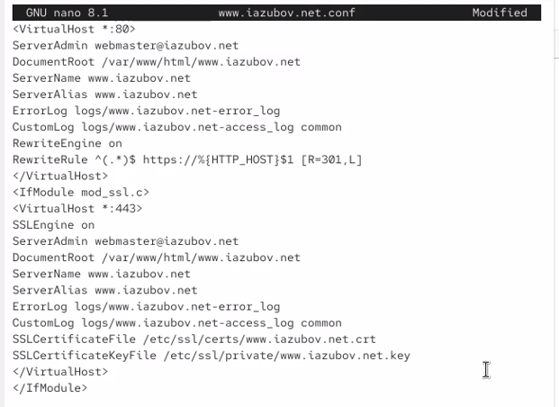
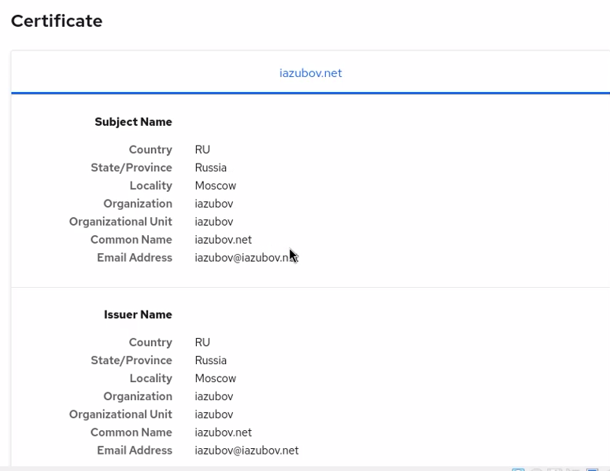

---
## Author
author:
  name: Зубов Иван Александрович
  degrees: DSc
  orcid: 0000-0002-0877-7063
  email: 1132243112@rudn.ru
  affiliation:
    - name: Российский университет дружбы народов
      country: Российская Федерация
      postal-code: 117198
      city: Москва
      address: ул. Миклухо-Маклая, д. 6
## Title
title: Лабораторная работа №5
subtitle: Презентация
license: CC BY
date: today
date-format: "YYYY-MM-DD" # Example: 2025-09-06
---

# Информация

## Докладчик

  * Зубов Иван Александрович
  * Студент
  * Российский университет дружбы народов
  * 1132243112@pfur.ru

# Выполнение лабораторной работы

## Запускаем наш сервер

:::::::::::::: {.columns align=center}
::: {.column width="70%"}

:::
::::::::::::::

## Создаем каталог private

:::::::::::::: {.columns align=center}
::: {.column width="70%"}

:::
::::::::::::::

## Сгенерируем ключ и сертификат

:::::::::::::: {.columns align=center}
::: {.column width="80%"}

:::
::::::::::::::

## Перейдем в каталог с конфигурационными файлами и отредактируем его.

:::::::::::::: {.columns align=center}
::: {.column width="80%"}

:::
::::::::::::::

## Внесем изменения в настройки межсетевого экрана на сервере

:::::::::::::: {.columns align=center}
::: {.column width="80%"}

:::
::::::::::::::

## Внесем изменения в настройки межсетевого экрана на сервере

:::::::::::::: {.columns align=center}
::: {.column width="80%"}

:::
::::::::::::::

## Перезапускаем сервер

:::::::::::::: {.columns align=center}
::: {.column width="80%"}

:::
::::::::::::::

## Проверка https

:::::::::::::: {.columns align=center}
::: {.column width="80%"}

:::
::::::::::::::

## Просмотр сертификата

:::::::::::::: {.columns align=center}
::: {.column width="70%"}

:::
::::::::::::::

## Установим пакеты для работы с PHP

:::::::::::::: {.columns align=center}
::: {.column width="80%"}

:::
::::::::::::::

## Редактируем файл

:::::::::::::: {.columns align=center}
::: {.column width="80%"}

:::
::::::::::::::

## Права доступа, контекст безопасности и перезапуск сервера

:::::::::::::: {.columns align=center}
::: {.column width="80%"}

:::
::::::::::::::

## Проверка php

:::::::::::::: {.columns align=center}
::: {.column width="80%"}

:::
::::::::::::::

## Создание каталога для ключа и сертификата и копирование файлов 

:::::::::::::: {.columns align=center}
::: {.column width="80%"}

:::
::::::::::::::

## Изменение скрипта http.sh

:::::::::::::: {.columns align=center}
::: {.column width="80%"}

:::
::::::::::::::
