---
## Author
author:
  name: Зубов Иван Александрович
  degrees: DSc
  orcid: 0000-0002-0877-7063
  email: 11232243112@rudn.ru
  affiliation:
    - name: Российский университет дружбы народов
      country: Российская Федерация
      city: Москва
      address: ул. Миклухо-Маклая, д. 6

## Title
title: "Лабораторная работа №5"
subtitle: "Отчет"
license: "CC BY"
abstract: |

---

# Введение

## Цель работы

Приобретение практических навыков по расширенному конфигурированию HTTPсервера Apache в части безопасности и возможности использования PHP.

## Задачи

1. Сгенерируйте криптографический ключ и самоподписанный сертификат безопасности для возможности перехода веб-сервера от работы через протокол HTTP
к работе через протокол HTTPS 
2. Настройте веб-сервер для работы с PHP 
3. Напишите (или скорректируйте) скрипт для Vagrant, фиксирующий действия по
расширенной настройке HTTP-сервера во внутреннем окружении виртуальной
машины server 

# Выполнение лабораторной работы

## Конфигурирование HTTP-сервера для работы через протокол HTTPS

Запускаем наш сервер

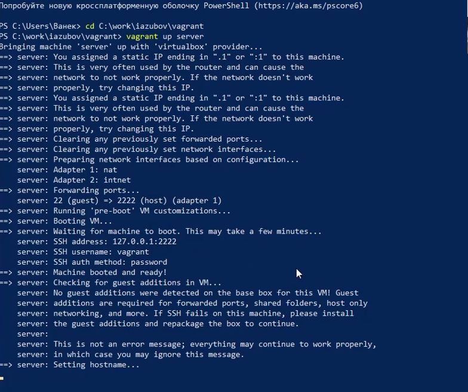{#fig-001 width=70%}

Переходим в режим суперпользователя. В каталоге /etc/ssl создаем каталог private

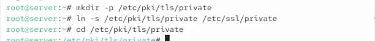{#fig-002 width=70%}

Сгенерируем ключ и сертификат. Заполняем его как сказано в файле лабораторной работы и копируем его

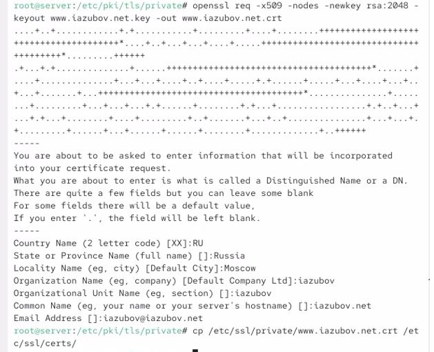{#fig-003 width=70%}

Перейдем в каталог с конфигурационными файлами и отредактируем его.

{#fig-004 width=70%}

Внесем изменения в настройки межсетевого экрана на сервере, разрешив работу с https

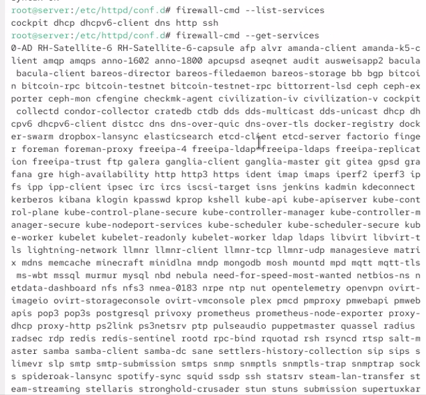{#fig-005 width=70%}

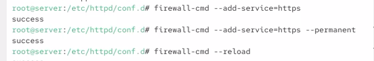{#fig-006 width=70%}

Перезапускаем сервер

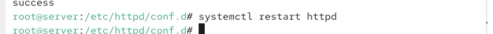{#fig-007 width=70%}

На виртуальной машине client в браузере открыт веб-сервер www.iazubov.net. Проверено, что соединение осуществляется по протоколу HTTPS

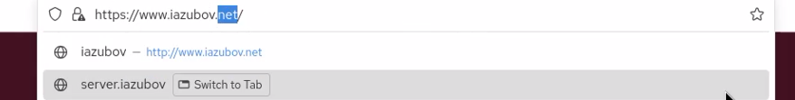{#fig-008 width=70%}

В браузере просмотрено содержание сертификата безопасности. В сертификате отображаются введённые ранее сведения: страна RU, организация iazubov, доменное имя iazubov.net и адрес электронной почты.

{#fig-009 width=70%}

## Конфигурирование HTTP-сервера для работы с PHP

Установиv пакеты для работы с PHP

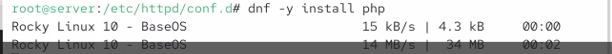{#fig-010 width=70%}

В каталоге веб-контента www.iazubov.net создан файл index.php, содержащий вызов функции phpinfo()

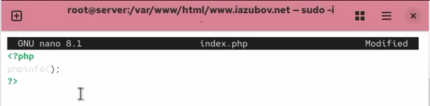{#fig-011 width=70%}

Для каталога /var/www установлен владелец apache:apache, после чего восстановлены контексты безопасности SELinux для /etc и /var/www. Затем HTTP-сервер перезапускаем.

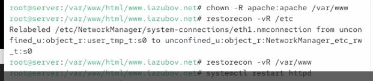{#fig-012 width=70%}

На виртуальной машине client открыта страница веб-сервера www.iazubov.net. В браузере успешно выведена страница phpinfo(), что подтверждает корректную работу PHP на веб-сервере.     005-http-adv

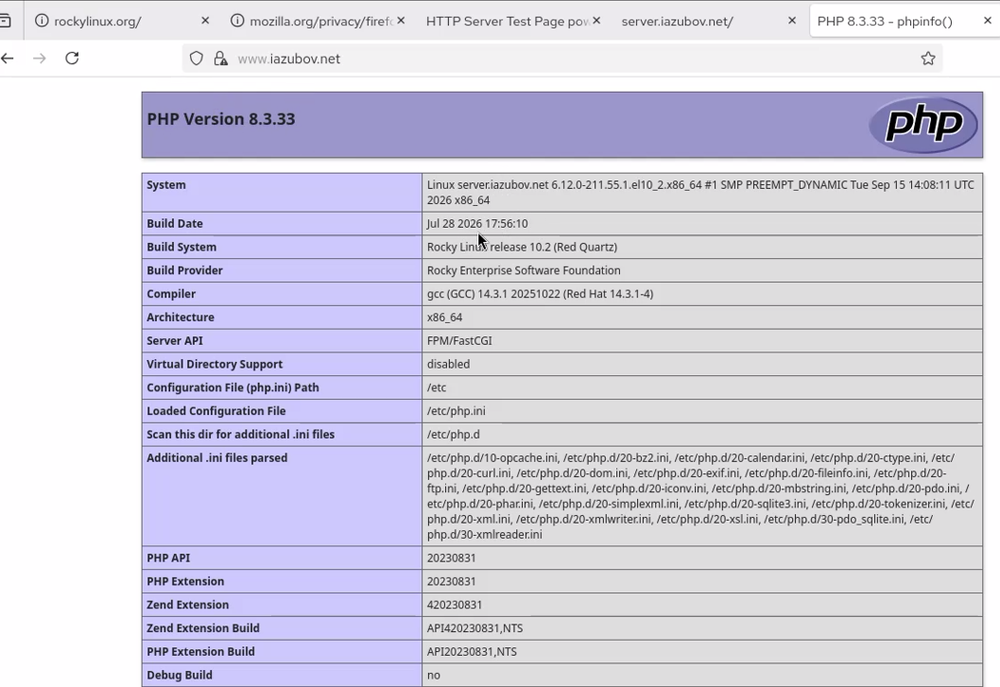{#fig-013 width=70%}

## Внесение изменений в настройки внутреннего окружения виртуальной машины

Конфигурационные файлы Apache и содержимое веб-сервера скопированы в каталог /vagrant/provision/server/http. Также созданы каталоги для ключа и сертификата и выполнено копирование файлов www.iazubov.net.key и www.iazubov.net.crt.

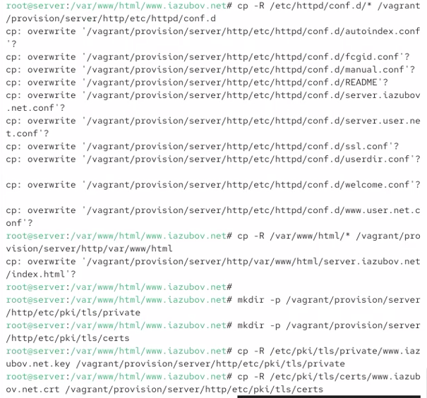{#fig-014 width=70%}

В скрипт /vagrant/provision/server/http.sh добавлены команды установки PHP и настройки межсетевого экрана для работы с HTTPS.

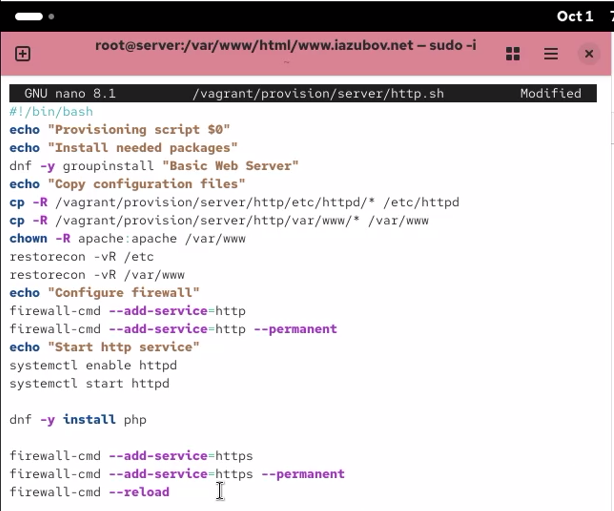{#fig-015 width=70%}

# Контрольный вопросы

1.В чём отличие HTTP от HTTPS?  HTTP передаёт данные без шифрования, а HTTPS использует защищённое шифрованное соединение. 005-http-adv

2.Каким образом обеспечивается безопасность контента веб-сервера при работе через HTTPS?
Безопасность обеспечивается шифрованием, аутентификацией и контролем целостности данных с помощью SSL/TLS. 005-http-adv

3.Что такое сертификационный центр? Приведите пример.
Сертификационный центр — это организация, которая подтверждает принадлежность открытого ключа владельцу и подписывает сертификаты. Пример: Let’s Encrypt.

# Заключение

В ходе работы настроены HTTPS и PHP на сервере Apache, а также проверена их корректная работа.

# Список литературы {.unnumbered}

Официальная документация Apache HTTP Server:
https://httpd.apache.org/docs/2.4/

Официальная документация PHP:
https://www.php.net/manual/ru/

Документация OpenSSL:
https://docs.openssl.org/

Документация firewalld:
https://firewalld.org/documentation/

\appendix

